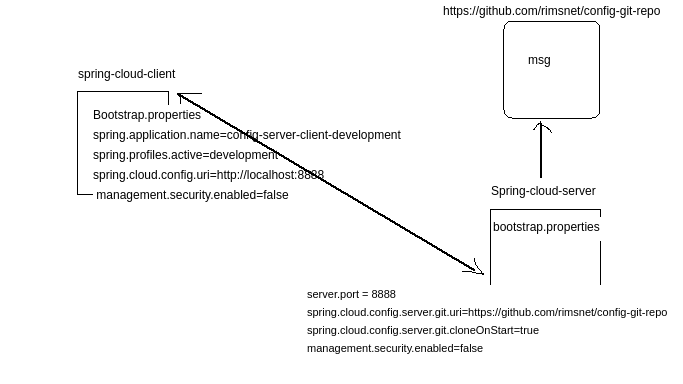

# MicroServices - Spring Cloud Config (Server and Client)

* Microservices approach now has become an industry standard for any new API development, and almost all the organizations are promoting it. 
* Spring cloud provides excellent tools to build these microservice on top of the Spring boot framework.
* In a Microservice world one of the feature called **Config Server**.

#### Config Server

* It is more like externalizing properties/resource file out of project codebase to an external service altogether.
* So that any changes to any given property does not necessitate the re-deployment of service which is using that property. 
* All such property changes will be reflected without redeploying the microservice.

## Why to Use Spring Cloud Config Server

* The idea of config server has come from the **12-factor app manifesto** related to the best practices guidelines of developing modern cloud-native applications. 
* It suggests to externalize properties or resource files out of server where the values of those resources vary during runtime – usually different configurations that will differ in each environment.

#### Twelve-Factor Methodology in a Spring Boot Microservice
* Ref: https://www.baeldung.com/spring-boot-12-factor

===========================================================================================================================================================
#### Running Notes
#### Test REST Endpoint

* Now in the browser open the /msg rest endpoint by browsing the url http://localhost:8080/msg. It should return Hello world - this is from config server which is mentioned in the config-server-client-development.properties file.

* http://localhost:8080/msg   

#### Test Property Change
* Now we will do a property change and test if this can be reflected in the config client service without restarting any of the Microservices.
* Do some change, in the value of the msg property in the config-server-client-development.properties and check-in in the local git, then hit the http://localhost:8080/msg again in the browser, You will the old value only.

* To reflect the new value, we need to refresh the configuration by hitting http://localhost:8080/refresh endpoint using POST method from any of the REST client.

* Once you have successfully refreshed the config client service, the new value should be reflected in the service response. This is because @RefreshScope annotation the Rest Controller that we have exposed.

* Things to check if facing any error

* Property file name and the Client module service name spring.application.name=config-server-client should be exactly same, otherwise, properties will not be detected. Actually, Config Server exposes the properties in an end point of property file name, if you browse URL http://localhost:8888/config-server-client/development it will return all the dev environment values.

* http://localhost:8888/config-server-client/development
